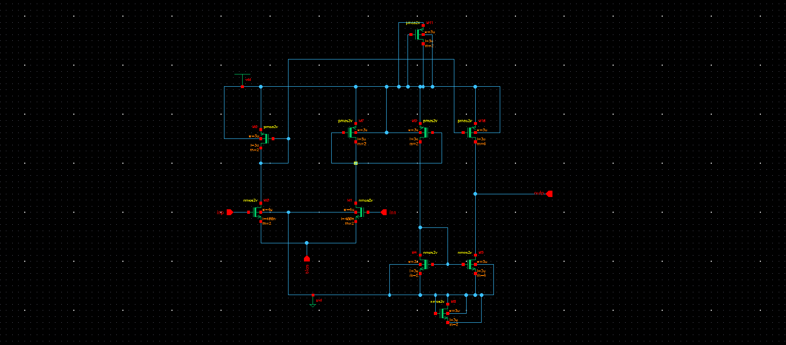
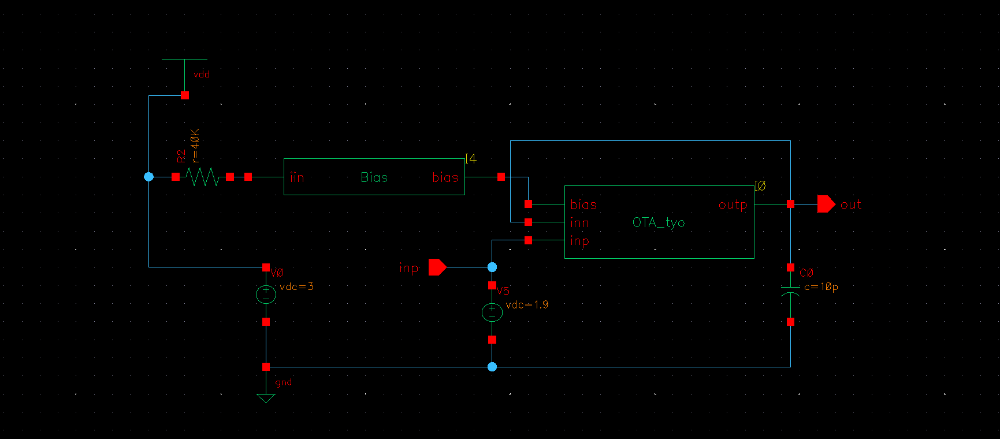
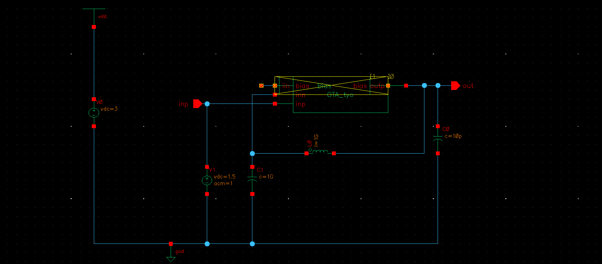

# OTA-Design-project
Design project of operational transcoductance amplifier using Cadence Virtuoso. 
Design was verified by various simulations using different testbenches.

## Design Specifications

| Parameter | Target |
|----------|--------|
| Supply Voltage (Vdd) | 3 V |
| Gain (A) | > 39 dB (≈ > 90 V/V) |
| Unity Gain Bandwidth (ft) | > 10 MHz |
| Slew Rate (SR) | > 10 MV/s |
| Phase Margin (PM) | > 60° |
| Output Linear Range | 0.6 – 2.2 V |
| Input Common-Mode Range | 1.5 – 2.3 V |
| Current Ratio (K) | 2 |

## Schematics
###OTA

###Testbench for DC-simulations

###Testbench for AC-simulations

